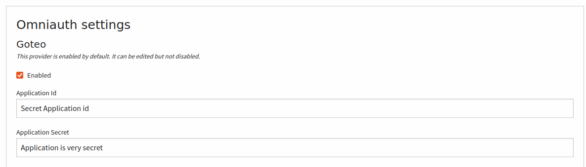
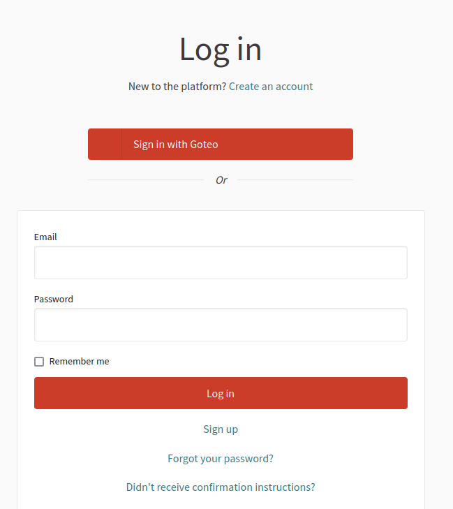

# decidim-goteo_oauth
A Decidim module to connect with Goteo as an OAuth provider

## Generating keys
In order to install it you will need to obtain the Goteo Oauth client id. You can do that by running on the oauth server, or ask your instance owner to register the Application:

```bash 
bin/console league:oauth2-server:create-client "Decidim installation" --grant-type authorization_code --redirect-uri http://your.decidim.installation.tld/users/auth/goteo/callback  --allow-plain-text-pkce
```

Addtionally, for develpment, you may need to specify the port. Assuming the decidim instance is running on `http://localhost:3000`, then you will need to run the following command.

```bash
bin/console league:oauth2-server:create-client "Decidim installation" --grant-type authorization_code --redirect-uri http://localhost:3000/users/auth/goteo/callback  --allow-plain-text-pkce
```

### Note
Decidim-Oauth-Goteo plugin, is working only with `authorization_code`.

## Gem install
Then add to your Gemfile the following line:
```ruby
gem "decidim-goteo_oauth", "~> 0.0.1"
```

After that, run in your bash console:

```bash
bundle install  
```
After this step is finished, you need proceed to configuration.

## Configuration

Add to your `config/secrets.yml` the Goteo APP oauth keys
```yaml
development:
  <<: *default
  omniauth:
    goteo:
      enabled: true
      app_id: # 
      app_secret: # 
    # Other provider configs 
  # Other Yaml configs like secret_key_base   
```

### Addtional configuration
You can further customise the installation by providing 2 additional key settings, that you could add to your `config/initializers/decidim.rb` or
`config/initializers/omniauth.rb`

```ruby
if defined?(Decidim::GoteoOauth)
  Decidim::GoteoOauth.oauth_scope = :TEST
  Decidim::GoteoOauth.oauth_client_options = {
    site: "http://Your.custom.tld/",
    authorize_url: '/authorize',
    user_info_url: '/userInfo',
    token_url: "/token",
    response_type: 'authorization_code'
  }
end 
```

After you make all the required configuration, you will need to restart Decidim installation, so you could make the newly installed code available onto your Instance.

After the restart, you will need to open your system admin panel, edit organization, click "Show advanced settings"


After you save the application you could visit the organization login page,


Clicking on the "Sign in with Goteo" will lead you to application authorization path, and afterwards to Decidim installation to either registration screen if there is no account available, or to previously visited page being already authenticated.
## Todo
Refactor the initialization setup, in order to add more granularity on the client_options